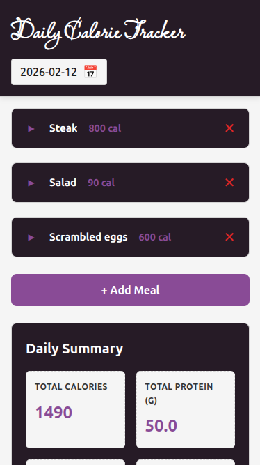

# 🥑 Calorie Counter (PWA)

A lightweight, single-page Progressive Web App (PWA) built with React. It allows users to track their daily macros and caloric intake without a backend—all data remains private and is stored locally on your device using IndexedDB.



## ✨ Features

- 100% Client-Side: No server, no accounts, complete privacy.
- Offline Capable: Works without an internet connection (PWA).
- Macro Tracking: Log meals with Calories, Proteins, Carbs, and Fats.
- Daily Summary: Visual summary of your nutritional intake per day.
- Calendar View: Easily navigate between dates to review history.

## 🛠 Tech Stack

- Frontend: React
- Storage: IndexedDB (Local Browser Storage)
- Deployment: Terraform into AWS lambda

A quick heads-up: Most of this code (aside from the Terraform) was generated by Claude Haiku 4.5 via Copilot. I handled the architecture and bug-squashing, so the internals might be a bit "experimental" in places. I don’t have any plans for a refactor — the app works, it solves my problem, and I’m perfectly happy with that.

## Setup

Install the dependencies:

```bash
npm install
```

## Get started

Start the dev server, and the app will be available at <http://localhost:8080>.

```bash
npm run dev
```

Build the app for production:

```bash
npm run build
```

Preview the production build locally:

```bash
npm run preview
```

Deploy into AWS (with your AWS credentials):

```bash
npm run deploy
```

## Learn more

To learn more about Rspack, check out the following resources:

- [Rspack documentation](https://rspack.rs) - explore Rspack features and APIs.
- [Rspack GitHub repository](https://github.com/web-infra-dev/rspack) - your feedback and contributions are welcome!
